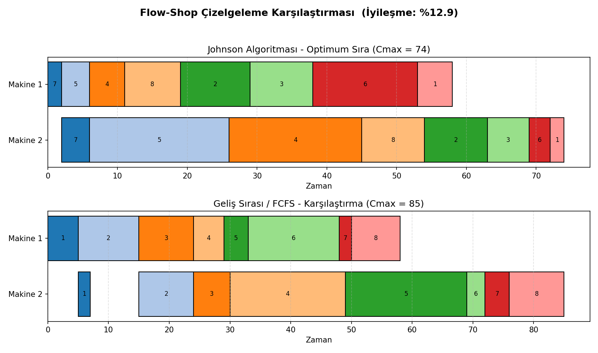

# johnson-algoritmasi-is-sirasi

Johnson Algoritması ile 2 makineli akış tipi (flow-shop) üretim hatlarında optimum iş sırasının belirlenmesi ve makespan (Cmax) minimizasyonu.

## Problem

Bir üretim hattında **n adet iş**, sırasıyla **Makine 1 → Makine 2** üzerinden geçmek zorundadır. Her işin her makinedeki işlem süresi bilinmektedir. Amaç, **toplam tamamlanma süresini (Cmax)** minimize eden iş sırasını bulmaktır.

Bu, klasik bir **üretim planlama / çizelgeleme (scheduling)** problemidir ve Endüstri Mühendisliğinde sıkça karşılaşılan bir konudur.

## Yöntem: Johnson Kuralı (1954)

1. İşleri iki gruba ayır:
   - **Grup A:** M1 süresi ≤ M2 süresi olan işler
   - **Grup B:** M1 süresi > M2 süresi olan işler
2. Grup A'yı M1 süresine göre **küçükten büyüğe** sırala.
3. Grup B'yi M2 süresine göre **büyükten küçüğe** sırala.
4. Nihai sıra = Grup A + Grup B

Bu algoritma 2 makineli flow-shop problemi için **matematiksel olarak kanıtlanmış optimum** sonucu verir (S.M. Johnson, *Optimal two- and three-stage production schedules*, 1954).

## İçerik

| Dosya | Açıklama |
|---|---|
| `johnson_algoritmasi.py` | Algoritmanın kendisi, makespan hesaplama, örnek çalıştırma |
| `gantt_gorsel.py` | Johnson sırası ile FCFS (geliş sırası) karşılaştırmalı Gantt şeması |
| `requirements.txt` | Gerekli Python paketleri |

## Kullanım

```bash
pip install -r requirements.txt

# Konsolda sonuçları görmek için
python johnson_algoritmasi.py

# Gantt şeması (PNG) üretmek için
python gantt_gorsel.py
```

## Örnek Çıktı

```
JOHNSON ALGORİTMASI (Optimum Sıra)
----------------------------------
İş-7 -> İş-5 -> İş-4 -> İş-8 -> İş-2 -> İş-3 -> İş-6 -> İş-1
Toplam tamamlanma süresi (Cmax): 74.0

Geliş Sırası (FCFS - karşılaştırma amaçlı)
------------------------------------------
İş-1 -> İş-2 -> ... -> İş-8
Toplam tamamlanma süresi (Cmax): 85.0

Johnson algoritması ile FCFS'e göre iyileşme: %12.9
```



## Genişletme Fikirleri

- **CDS Sezgiseli (Campbell-Dudek-Smith):** Johnson kuralını 2'den fazla makineye genelleştirir.
- **NEH Algoritması:** n-makineli flow-shop problemleri için sezgisel yaklaşım.
- **Gecikme cezası (tardiness):** Her işe teslim tarihi eklenerek gecikme minimizasyonu.
- Gerçek üretim verisiyle (CSV içe aktararak) canlı test.

## Kaynak

Johnson, S.M. (1954). *Optimal two- and three-stage production schedules with setup times included.* Naval Research Logistics Quarterly, 1(1), 61-68.
